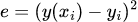

# مقدمه، رگرسیون/طبقه بندی، توابع هزینه، و گرادیان کاهشی
*«یک برنامه یادگیرنده برنامه رایانه‌ای است که به آن گفته شده تا از تجربه E مطابق با برخی وظایف T، و کارایی عملکرد P برای وظیفه T که توسط P سنجیده می‌شود، یاد بگیرد که تجربه E را بهبود ببخشد.»*

خیلی واضح نیست، درسته؟ این قسمت، اولین قسمت از مجموعه آموزش های یادگیری ماشین است، با هدف دسترسی به آموزش های یادگیری ماشین برای هرکسی که مشتاق یادگیری است. ما این دوره را طراحی کرده‌ایم تا درک کاملی از نحوه عملکرد الگوریتم‌های یادگیری ماشین  به شما بدهیم و همچنین دانشی را برای استفاده از آن در پروژه‌های خود به شما ارائه دهیم.
## یادگیری ماشین چیست؟
یادگیری ماشین مفهوم دشواری نیست. در حقیقت، اکثریت قریب به اتفاق الگوریتم‌های یادگیری ماشین تنها با یک کار ساده سروکار دارند: ترسیم خطوط. یادگیری ماشین تنها کاری که میکند ترسیم خطوطی است که به الگو ها اشاره میکنند. این به چه معنی است؟ بیایید به یک مثال ساده نگاه کنیم.
## طبقه بندی
فرض کنید شما یک کامپیوتر هستید که مجموعه ای از تصاویر سیب و نارنجی را در اختیار دارید. از هر تصویر می توانید رنگ و اندازه یک میوه را تشخیص بدید و می خواهید تصاویر را به عنوان تصویر سیب یا پرتقال طبقه بندی کنید. اولین گام در بسیاری از الگوریتم‌های یادگیری ماشین، بدست آوردن داده‌های آموزشی برچسب‌گذاری شده است. در مثال ما، این به معنای دریافت تعداد تصاویر زیادی از میوه هاست که هر کدام به عنوان سیب یا پرتقال برچسب خورده اند. از این تصاویر، می‌توانیم اطلاعاتِ رنگ و اندازه را استخراج کنیم و سپس ببینیم که چگونه با سیب یا پرتقال بودن ارتباط دارند. برای مثال، نمودار داده‌های آموزشی برچسب‌گذاری‌شده ما ممکن است چیزی شبیه به این باشد:

x های قرمز، سیب و x های نارنجی، نارنجی هستند. همانطور که احتمالا متوجه خواهید شد یک الگو در داده ها وجود دارد. به نظر می رسد سیب ها در سمت چپ نمودار جمع می شوند زیرا عمدتا قرمز هستند و نارنجی ها به نظر می رسد در سمت راست جمع می شوند زیرا اکثراً نارنجی هستند. ما می خواهیم الگوریتم ما این نوع الگوها را یاد بگیرد.

برای این مسئله خاص، هدف ما ایجاد الگوریتمی است که خطی را بین دو گروه برچسب‌گذاری شده ترسیم کند که مرز تصمیم نامیده می‌شود. ساده ترین مرز تصمیم گیری برای داده های ما ممکن است چیزی شبیه به این باشد:

فقط یک خط مستقیم بین سیب و پرتقال برای تشخیص این دو از هم کافی است. با این حال، الگوریتم‌های یادگیری ماشین بسیار پیچیده‌تر ممکن است در نهایت مرزهای تصمیم گیری بسیار پیچیده‌تری را ترسیم کنند، مانند موارد زیر:

فرض ما این است که خطی که برای تشخیص تصویر سیب از تصویر نارنجی در داده‌های آموزشی برچسب‌گذاری شده‌مان در بالا کشیده‌ایم، می‌تواند سیب را از پرتقال در هر تصویری تشخیص دهد. به عبارت دیگر، وقتی که نمونه هایی از سیب و پرتقال را به الگوریتم میدهیم تا یاد بگیرد، الگوریتم می تواند تجربه خود را به تصاویر سیب و پرتقال که قبلاً هرگز با آنها برخورد نکرده است تعمیم دهد. به عنوان مثال، اگر تصویری از یک میوه به ما داده شود که با X آبی در زیر نشان داده شده است، می‌توانیم آن را به عنوان یک نارنجی بر اساس مرز تصمیمی که ترسیم کرده‌ایم طبقه‌بندی کنیم:

این قدرت یادگیری ماشین است. برنامه، داده های آموزشی را دریافت میکند و الگوریتمی را روی آن اجرا میکند تا مرز های تصمیم گیری مشخص شود و سپس آنچه را که آموخته است را به داده های جدید تعمیم میدهد.

البته، تمایز بین سیب و پرتقال یک کار کاملاً پیش پا افتاده است. با این حال، ما می‌توانیم این استراتژی را برای مشکلات بسیار هیجان‌انگیزتر مانند طبقه‌بندی تومورها به عنوان بدخیم یا خوش‌خیم، علامت‌گذاری ایمیل‌ها به عنوان هرزنامه یا غیر هرزنامه، یا تجزیه و تحلیل اثر انگشت برای سیستم‌های امنیتی اعمال کنیم. این نوع یادگیری ماشین – رسم خطوطی برای جداسازی داده ها – تنها یکی از زیرشاخه های یادگیری ماشین است که طبقه بندی نامیده می شود. زیرشاخه دیگری به نام رگرسیون وجود دارد که همه چیز آن درباره رسم خطوطی است که داده ها را توصیف کند(مانند حدس قیمت خانه)
## رگرسیون
فرض کنید داده های برچسب گذاری شده ای داریم که متراژ و قیمت خانه را نشان میدهند، اگر نمودار آن را رسم کنیم مانند زیر میشود :

هر یک از X ها، نشان دهنده قیمت یک خانه با توجه به متراژ آن است. توجه داشته باشید که اگرچه داده ها دارای مقداری پراکندگی هستند، اما یک الگو بین آنها وجود دارد: با بزرگ‌تر شدن خانه‌ها، گران‌تر نیز می‌شوند. ما می خواهیم الگوریتم ما این الگو را پیدا کند و از آن برای پیش بینی قیمت خانه بر اساس متراژ خانه استفاده کند.

فقط با نگاهی شهودی به داده های آموزشی می توانیم متوجه شویم که یک الگوی خطی در نمودار وجود دارد که به نظر می رسد اکثر خانه ها روی آن قرار دارند. می‌توانیم این ایده را تعمیم دهیم و بگوییم که همه خانه‌ها احتمال زیادی برای قرار گرفتن بر روی این الگوی خطی خواهند داشت. به عنوان مثال، احتمال بسیار بالایی وجود دارد که یک خانه در X سبز در نمودار زیر قرار گیرد و احتمال بسیار کمی وجود دارد که یک خانه در X قرمز در نمودار زیر باشد:

اکنون می‌توانیم حتی بیشتر تعمیم دهیم و بپرسیم، برای هر متر مربع مشخص، قیمت یک خانه چقدر خواهد بود؟ البته دریافت مقدار دقیق سخت خواهد بود. با این حال میتوانیم یک مقدار تقریبی را به سادگی بدست بیاوریم. برای انجام این کار، یک خط رسم میکنیم که نزدیکترین فاصله را به همه ی نقاط(تا حد امکان) داشته باشد. این خط که predictor یا پیش بینی کننده نامیده می‌شود، قیمت یک خانه را از متراژ مربع آن پیش‌بینی می‌کند. این پیش بینی کننده، «متوسط» قیمت یک خانه را با توجه به متراژ حساب میکند :

پیش‌بینی‌کننده لزوماً نباید خطی باشد، می تواند هر نوع تابع یا مدلی باشد که می توانید تصور کنید - توابع درجه دوم، سینوسی و حتی دلخواه را میتوان به کار برد. با این حال، استفاده از پیچیده ترین مدل برای پیش بینی همیشه کارساز نیست. توابع مختلف برای مشکلات مختلف بهتر کار می کنند و این به برنامه نویس بستگی دارد که بفهمد از چه مدلی استفاده کند.

با نگاهی به مدل خود برای پیش بینی قیمت خانه، می‌توانیم بپرسیم: چرا خود را به یک متغیر ورودی محدود کنیم؟ معلوم می شود که می توانیم انواع اطلاعاتی را که بخواهیم در نظر بگیریم، مانند هزینه زندگی در شهر، شرایط، مصالح ساختمانی و غیره. به عنوان مثال، می‌توانیم قیمت را بر اساس هزینه زندگی در محل خانه و متراژ مربع آن در یک نمودار واحد مانند این ترسیم کنیم، که در آن محور عمودی قیمت را نشان می‌دهد و دو محور افقی متراژ مربع و هزینه زندگی را نشان می‌دهد:

در این مورد ما دوباره می‌توانیم یک پیش‌بینی‌کننده برای داده‌ها قرار دهیم. اما به جای ترسیم یک خط از میان داده ها، باید یک صفحه از میان داده ها ترسیم کنیم، زیرا بعد داده های ما افزایش پیدا کرده است.

نمونه‌هایی از یک و دو متغیر ورودی را دیده‌ایم، اما بسیاری از برنامه‌های یادگیری ماشین صدها و حتی هزاران متغیر را در نظر می‌گیرند. اگرچه متأسفانه انسان ها قادر به تجسم چیزی بالاتر از سه بعدی نیستند، اما همان اصولی که اخیراً آموختیم در مورد آن سیستم ها نیز اعمال خواهد شد و از چیزی به نام HyperPlain استفاده می شود.
## پیش بینی کننده
همانطور که قبلا ذکر کردیم، انواع مختلفی از پیش بینی ها وجود دارد. در مثال پیش بینی قیمت خانه، از یک مدل خطی برای تقریب داده های خود استفاده کردیم. شکل ریاضی یک پیش بینی خطی چیزی شبیه به این است:

هر x نشان دهنده یک ویژگی ورودی متفاوت است، مانند متراژ مربع یا هزینه زندگی، و هر c یک پارامتر یا وزن نامیده می شود. هر چه وزن خاص بیشتر باشد، مدل آن ویژگی را در پیش بینی بیشتر دخیل میکند. به عنوان مثال، متراژ مربع پیش بینی خوبی برای قیمت خانه است، بنابراین الگوریتم ما باید با افزایش ضریب مربوط به متراژ مربع، به متراژ مربع توجه زیادی داشته باشد. در مقابل، اگر داده‌های ما شامل تعداد پریزهای برق در خانه باشد، الگوریتم ما احتمالاً وزن نسبتاً کمی به آن می‌دهد زیرا تعداد پریزها ارتباط زیادی با قیمت یک خانه ندارد.

در مثال ما که پیش بینی قیمت خانه از روی متراژ مربع است، از آنجایی که ما فقط یک متغیر(متراژ مربع) را در نظر می‌گیریم، مدل ما فقط به یک ویژگی ورودی یا فقط یک x نیاز دارد:

میتوانیم معادله بالا را مانند معادله ی خطی که در دبیرستان تدریس می شود، بازنویسی کنیم :

y(x) خروجی ما یا همان قیمت خانه است و x ویژگی ما یا اندازه خانه است. c0 عرض از مبدا(بایاس) y است که برای قیمت پایه خانه است و به قیمت محاسبه شده اضافه میشود.

اکنون این سوال پیش می‌آید: چگونه یک الگوریتم یادگیری ماشین c0 و c1 را انتخاب می‌کند تا خط به بهترین شکل قیمت خانه را پیش‌بینی کند؟

در اینجا شایان ذکر است که ضرایب را می توان به طور مستقیم و بسیار کارآمد از طریق یک رابطه ماتریسی به نام [معادله نرمال](http://mathworld.wolfram.com/NormalEquation.html) پیدا کرد. با این حال، از آنجایی که این روش هنگام کار با صدها یا هزاران متغیر ناممکن می شود، ما از روشی که اغلب الگوریتم های یادگیری ماشین استفاده می کنند استفاده خواهیم کرد.
## توابع هزینه
تابع هزینه(تابع ضرر)، تابعی است که مقدار خطای مدل ما را محاسبه میکند، در واقع این تابع مقدار اشتباهات مدل ما محاسبه میکند. تابع هزینه یک خط(مانند آنچه در بالا رسم کردیم) را همراه مقداری داده برچسب گذاری شده(داده آزمایشی) میگیرد و سعی میکند هر کدام را پیش بینی کند و اختلاف بین برچسب اصلی و برچسبی که پیش بینی کرده است را به عنوان هزینه به ما میدهد. هر چه این مقدار خطا کمتر باشد، به این معنی است که مدل ما  پیش بینی بهتری انجام میدهد، و هر چه این مقدار بیشتر باشد به این معنی است که مدل ما ضعیف است و در پیش بینی دچار خطا می شود.

بهترین مدل، مدلی است که هزینه را به حداقل برساند، به عنوان مثال سه تابع پیش بینی کننده زیر را داریم :

پیش‌بینی‌کننده‌های a و c با داده‌ها مطابقت ندارند، و تابع هزینه ما باید به این دو خط، هزینه بالایی بدهد. از سوی دیگر، به نظر می‌رسد پیش‌بینی‌کننده b به خوبی با داده‌ها مطابقت دارد، و در نتیجه تابع هزینه ما باید هزینه بسیار پایینی به آن بدهد.

اما تابع هزینه، هزینه را چگونه محاسبه میکند ؟ در واقع انواع مختلفی از توابع هزینه وجود دارند که میتوانیم از آنها استفاده کنیم، اما برای این مثال از یک مورد که بسیار رایج به نام «**خطای میانگین مربعات**» استفاده میکنیم.

بیایید نام «**خطای میانگین مربعات**» را تجزیه کنیم. خطا در این مورد به معنای فاصله عمودی بین برچسب اصلی و برچسب پیش بینی شده است و به صورت  (y - y_pred​)  محاسبه می شود که y برچسب اصلی و y_pred برچسب پیش بینی شده است. میتوانیم خطا را به صورت زیر نشان دهیم :

بنابراین برای یک نقطه داده منفرد (xi,yi)، که در آن xi متراژ مربع خانه و yi قیمت خانه است، و  y(x) تابع پیش بینی کننده، **خطای مربعات** برابر است با:

نکته خوب در مورد خطای مربعات این است که همیشه مثبت است. به این ترتیب می توانیم خطا را به حداقل برسانیم. اکنون میانگینی از خطای کل هر نقطه از داده می گیریم تا خطای میانگین مربعات را بدست آوریم:

در اینجا، ابتدا مجذور یک به یک خطا هارا جمع کرده و بر تعداد داده هایی که داریم تقسیم کرده ایم(در اینجا با N نمایش داده ایم)، و به خطای میانگین مربعات رسیده ایم.
## گرادیان کاهشی
وقتی تابع هزینه را نمودار می کنیم (با دو متغیر) چیزی شبیه به این خواهد شد:

اکنون، کاملاً واضح است که حداقل این تابع هزینه کجاست. میتوانیم با چشم آن را ببینیم. با این حال، به یاد داشته باشید که ما فقط یک ویژگی داریم - متراژ مربع. در واقعیت، تقریباً همه برنامه‌ها بسیار بیشتر از یک ویژگی دارند. در برخی موارد، تا ده ها میلیون پارامتر ما داریم و نمیتوان مانند این نمودار، تابع هزینه آن را رسم کرد، زیرا اصلا قابل تصور نیست!
بنابراین، برای یافتن حداقل هزینه ممکن در ابعادی بسیار بالا، از الگوریتمی به نام گرادیان کاهشی استفاده خواهیم کرد و  گرادیان کاهشی را در دو بعد توضیح خواهیم داد، اما الگوریتم میتواند به هر بعدی تعمیم شود!

برای شروع، تصور کنید که یک توپ را در امتداد نمودار تابع هزینه غلت بدید. همانطور که توپ غلت می زند، همیشه شیب دارترین مسیر را دنبال می کند و در نهایت در انتها روی کمترین شیب متوقف می شود. به طور خلاصه، گرادیان کاهشی یعنی همین که گفتیم. هر نقطه ای از نمودار هزینه(مانند آنچه در بالا دیدیم) را انتخاب می کنیم، جهتی را که تندترین شیب را دارد پیدا می کنیم، کمی در آن جهت حرکت می کنیم و این کار را تکرار میکنیم، در نهایت، ما باید به حداقل تابع هزینه رسیده باشیم و مقدار پارامتر های خود را با توجه به نقطه ای که در آن قرار داریم، انتخاب میکنیم.
## چه چیزی یاد گرفتم ؟
پس از خواندن همه این موارد، امیدواریم که یادگیری ماشین در حال حاضر برای شما معنادارتر شود. و امیدوارم که آنقدرها که قبلاً فکر می کردید، پیچیده به نظر نمی رسد. فقط به یاد داشته باشید که یادگیری ماشین به معنای واقعی کلمه کشیدن خط است و تمام.
یادگیری ماشین فقط تشخیص الگو است. الگوریتم‌های یادگیری ماشین با ترسیم خطوط با توجه به داده‌ها، الگوها را یاد می‌گیرند و با الگوی های یادگرفته شده، ورودی های جدید را پیش بینی میکنند.

اما این سؤال پیش می‌آید که آیا یادگیری ماشین واقعاً «یادگیری» است؟ خب، چه کسی میتواند بگوید که یادگیری چیزی غیر از فهمیدن الگوهاست؟

